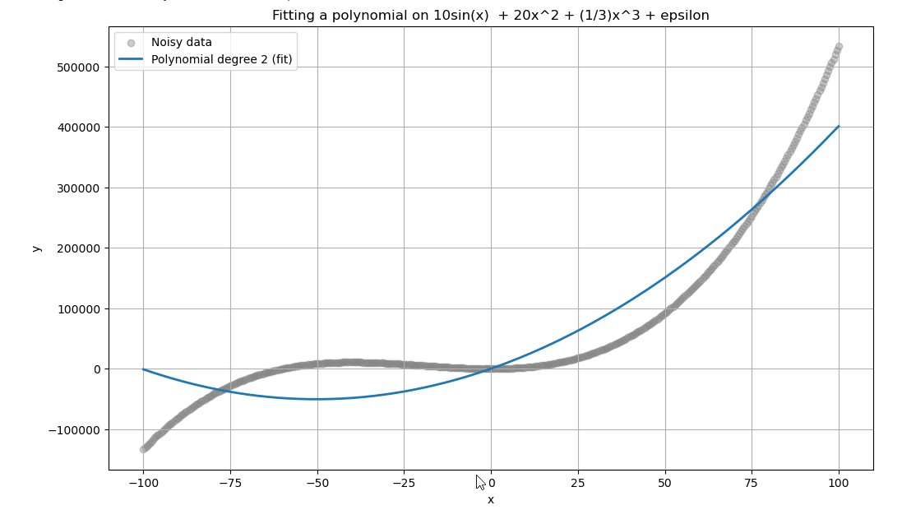

# Smooth Spline Regression

**Author:** Antoine Koltou

## Presentation 

This project is a purely **theoretical mathematical exploration**. While I was researching new non-linear machine learning models, I came across this specific model. Its core idea really interested me, and I was somewhat frustrated trying to understand how to use it without fully understanding how it works internally and secondly i was looking into working on a more "classical mathematical" problem than a machine learning one this time. That's why I developed this implementation, which is really not optimized; I consciously chose to avoid optimizations because they can obscure the mathematical clarity.  

This particular model, Smooth Spline Regression, isn't designed for practical use, mainly due to computational issues associated with the large number of parameters.

This particular model, Smooth Spline Regression, often doesn't find widespread applied usage, mainly due to computational issues associated with the large number of parameters.

However, the **core idea is really really interesting**. If you are seeking a more realistic and computationally efficient model, i can only recommend you the **classic Spline Regression** which is a highly effective alternative.

---

## I - Why Smooth Spline Regression? 

### The Limitations of Linear and Polynomial Regression

**Linear Regression** suffers from a huge issue: the assumption of a huge **bias**. While efficient when the true relationship is linear, it fails spectacularly for polynomial, logarithmic, or other complex target expressions.

One common solution is to introduce new transformed terms, expressing $y$ as a **polynomial expression**:
$$y_i = \beta_0 + \beta_1 x_i + \beta_2 x_i^2 + \epsilon_i$$
The issue with **polynomials** is their excessive "flexibility." A polynomial that fits well in the center of the data can quickly **"drift away"** from the reality as we move further and further from the center.

*(As we can see on the left side, the model will go to a completly opposite direction compared to the real function. If the relation was linear the errors would have been smaller for that side of the dataset)*

Polynomials are powerful approximators, as we will see, but they must be **controlled and regulated**. And secondly, you have to be absolutely sure of the form your data is taking. Miss just one degree and everything is off! 
Finding the right polynomial can quickly become very difficult. You can ease this task by introducing cross-validation. However, cross-validation is not a magical solution: sometimes it can still miss important terms or even add unnecessary ones. For example, if the underlying data follows a third-degree polynomial, cross-validation might still select a fourth-degree term because it produces a slightly better average MSE than the true third-degree model.

The solution lies in using **splines**, it's the best solution, you get the benefits of polynomials without their extreme instability.

---

## II - What's a Spline? 

A **spline** is a composite curve constructed from a **chain of polynomial functions** that are **continuous** and **smooth** where they join.

This "natural" aspect is achieved by imposing **continuity constraints** not only on the polynomial functions themselves but also on their **first and second derivatives** at the points where they connect, known as **knots**. These constraints give splines their smooth and natural appearance.

### Why Choose Splines?

Splines offer superior **flexibility** and **stability** compared to a single high-degree polynomial:

1.  **Local Adaptability:** They can be adjusted to be almost **linear at the extrema** (adding stability) while remaining **flexible** and adaptable in high-variance regions where most data is concentrated.
2.  **Handling Different Relations:** Splines can effectively model multiple underlying relationships within a single training dataset. For example, a dataset might exhibit an **exponential relation** over $[0; 50]$ and just after a **logarithmic relation** over $[50; \infty[$. A single high-degree polynomial would be completly off because the real relation is much more complex, and using two separate equations would break the **continuity** and **natural evolution** between the two parts. Splines, by design, resolve this.

### The Approximation Power

Since splines are only composed of polynomials, one might initially worry about their inability to directly represent non-polynomial relations like $\ln(x)$, $e^x$, or $\sin(x)$.

However, as we all know from our Calculus II classes, **Taylor Theorem** states that almost any function can be accurately represented by a series of polynomial terms:
$$f(x) = \sum_{k=0}^{\infty} \frac{f^{(k)}(a)}{k!}(x-a)^k$$
This means that splines are, in fact, one of the **most powerful tools** for approximating and representing virtually any complex relationship.

---

## III - The Formulas: Smooth Spline Regression 

### The Overfitting Problem and the Loss Function

In **classical Spline Regression**, knots are set at specific, strategic points. In **Smooth Spline Regression**, we place a knot at **every single observation**, $x_i$. Our initial impression is that this must lead to a completely **overfitted** model, essentially fitting the data perfectly with $f(x_i) = y_i$. Which is a completly non-sense lol.

To prevent this extreme overfitting, we introduce a **penalization** term into the classic **Loss Function**, also known as the **Penalized Residual Sum of Squares (PRSS)**:
$$J(f) = \sum_{i=1}^{n} \left(y_i - f(x_i)\right)^2 + n \cdot \lambda \cdot \int \left(f''(x)\right)^2 dx$$

* **Left Term (RSS):** The standard **Residual Sum of Squares**, penalizing lack of fit to the data.
* **Right Term (Penalty):** This term penalizes the **flexibility** (or **roughness**) of the model. The second derivative, $f''(x)$, measures the **local curvature** of the function. Integrating its square over the domain penalizes **rapid changes in slope**. (By the way, it look quite similar to the penalization term in Lasso & Ridge regression which are way more popular)

### The Hyperparameter: $\lambda$

We introduce the hyperparameter $\lambda \ge 0$:

* A **higher $\lambda$** (e.g., $\lambda \to \infty$) applies a **higher penalty** to flexibility, forcing $f''(x) \to 0$. The resulting model tends towards a flat **linear model**.
* A **lower $\lambda$** (e.g., $\lambda \to 0$) reduces the penalty, allowing the function to become more flexible, approaching the **overfitted interpolating spline**.

The key challenge is selecting the optimal $\lambda$. This is typically achieved through **Cross-Validation (CV)**, where the data is split (e.g., 10-fold CV), and the $\lambda$ that minimizes the **MSE** across all folds is selected.

However Smooth Spline Regression falls into a special case of cross validation, we can actually compute LOOCV (A special case of K-Fold CV where K=n). Here's the formula :

$$
\text{LOOCV}(\lambda) = \sum_{i=1}^{n} \left( \frac{y_i - \hat{g}_{\lambda}(x_i)}{1 - S_{\lambda,ii}} \right)^2
$$

Two new objects appeared: $\mathbf{S_\lambda}$ and $\hat{g}(x_i)$. Let's start with $S_\lambda$.

To produce a prediction $\hat{y}_i$, we use an application

$$
\phi: \mathbb{R}^p \to \mathbb{R}, \quad \hat{y}_i = \phi(x_i) = B(x_i) \, \beta
$$

where $\beta \in \mathbb{R}^d$ is the vector of coefficients that converts a transformed observation into a prediction.  

However, $S_\lambda$ has another purpose:

$$
S_\lambda : \mathbb{R}^n \to \mathbb{R}^n, \quad S_\lambda y = \hat{y}
$$

At first sight, it might seems like a complete non-sense, why would we want to predict something that is already an result ? 
But it's purposes actually resides in it's training because it measures how much the model "influences" $y$. how much each $y_j$ contributes to producing $\hat{y}_j$.

The diagonal entries $S_{\lambda,ii}$ measure the leverage of the $i$-th observation, i.e., how much $y_i$ influences its own prediction $\hat{y}_i$.

Finally, there's : 

$$
\hat{g}_\lambda = S_\lambda y
$$

which is the vector of fitted values based on all training observations, it can only be used for the training process.

### Matrix Algebra

The loss function **$J(f)$** can be re-expressed using **matrix algebra**, which simplifies the optimization:
$$J(\boldsymbol{\beta}) = (\mathbf{y} - \mathbf{B}\boldsymbol{\beta})^T (\mathbf{y} - \mathbf{B}\boldsymbol{\beta}) + n \cdot \lambda \cdot \boldsymbol{\beta}^T \mathbf{\Omega} \boldsymbol{\beta}$$

Let's see what each term represent.

#### The Basis Matrix $\mathbf{B}$

The **Basis Matrix $\mathbf{B}$** contains all the basis function evaluations for each observation. For a cubic spline, the basis function vector $\mathbf{b}(x)$ has $n+4$ elements:

$$\mathbf{B} = \begin{bmatrix} \mathbf{b}(x_1) \\ \mathbf{b}(x_2) \\ \vdots \\ \mathbf{b}(x_n) \end{bmatrix}$$

The basis function $\mathbf{b}(x)$ maps an observation $x \in \mathbb{R}$ to a vector in $\mathbb{R}^{1 \times (n+4)}$. The columns of $\mathbf{B}$ contain the transformations applied to the data: the first four columns are based on classical polynomials ($1, x, x^2, x^3$), and the remaining $n$ columns are based on the **knots transformations**.

The knots transformation for observation $x$ relative to knot $x_i$ is given by the function **$(x - x_i)_+^3$**. This is a **piecewise function**:
* If the observed value **$x$ is greater than the knot $x_i$**, the transformation is applied: $(x - x_i)^3$.
* If **$x$ is less than or equal to $x_i$**, the coefficient is set to **zero** (nullified).

#### The Curvature Matrix $\mathbf{\Omega}$

The **$\mathbf{\Omega}$ matrix** (Omega) measures the **curvature** of the basis functions. Its components are defined by the integral of the product of the second derivatives of the basis functions:
$$\mathbf{\Omega}_{j,k} = \int \mathbf{b}''_j(x) \mathbf{b}''_k(x) dx$$

#### Optimization and Solution

To find the optimal parameter vector $\boldsymbol{\beta}$ that minimizes the loss function $J(\boldsymbol{\beta})$, we take the partial derivative with respect to $\boldsymbol{\beta}$ and set it to zero:
$$\frac{\partial J}{\partial \boldsymbol{\beta}} = -2 \mathbf{B}^T (\mathbf{y} - \mathbf{B}\boldsymbol{\beta}) + 2 n \lambda \mathbf{\Omega} \boldsymbol{\beta} = \mathbf{0}$$

$$-2 \mathbf{B}^T (\mathbf{y} - \mathbf{B}\boldsymbol{\beta}) + 2 n \lambda \mathbf{\Omega} \boldsymbol{\beta} = \mathbf{0}$$
$$- \mathbf{B}^T (\mathbf{y} - \mathbf{B}\boldsymbol{\beta}) + n \lambda \mathbf{\Omega} \boldsymbol{\beta} = \mathbf{0}$$
$$
-\mathbf{B}^T \mathbf{B} \boldsymbol{\beta} + n \lambda \mathbf{\Omega} \boldsymbol{\beta}  = \mathbf{B}^T \mathbf{y}$$
$$(\mathbf{B}^T \mathbf{B} + n \lambda \mathbf{\Omega})\boldsymbol{\beta} = \mathbf{B}^T \mathbf{y}$$
$$\boldsymbol{\beta} = (\mathbf{B}^T \mathbf{B} + n \lambda \mathbf{\Omega})^{-1} \mathbf{B}^T \mathbf{y}$$

The final solution for the parameter vector $\boldsymbol{\beta}$ is a direct application of the **Least Squares** principle, modified by the penalty:

**There is no iterative optimization algorithm** needed; the solution is derived in a single, closed-form matrix operation.

---

## IV - The Multivariate Case

The problem can be extended to $p$ dimensions using the **General Additive Model (GAM)**, where the predictor is modeled as a sum of smooth functions of each individual feature:
$$y_i = f_1(x_{1i}) + f_2(x_{2i}) + \dots + f_p(x_{pi}) + \epsilon_i$$

### Matrix Representation

For the GAM approach, the matrices are constructed as follows:

* **Basis Matrix $\mathbf{B}$** : The basis matrices for each variable ($\mathbf{B}_1$ for $x_1$, $\mathbf{B}_2$ for $x_2$, etc.) are merged **horizontally**. This means the full matrix $\mathbf{B}$ is formed by placing the individual basis matrices side-by-side, reflecting the independent contribution of each variable to the model prediction.
    $$\mathbf{B} = [\mathbf{B}_1, \mathbf{B}_2, \dots, \mathbf{B}_p]$$

* **Curvature Matrix $\mathbf{\Omega}$** : This matrix is a **merge** of the individual penalty matrices ($\mathbf{\Omega}_j$). It is a **block-diagonal matrix** that places each penalty matrix ($\mathbf{\Omega}_j$) on its own diagonal, with zeros filling the remaining space. This structure ensures that the curvature penalty for $x_j$ does not affect the smoothing of $x_k$ (additivity).

$$
\mathbf{\Omega} =
\begin{bmatrix}
\mathbf{\Omega}_1 & \mathbf{0} & \dots & \mathbf{0} \\
\mathbf{0} & \mathbf{\Omega}_2 & \dots & \mathbf{0} \\
\vdots & \vdots & \ddots & \vdots \\
\mathbf{0} & \mathbf{0} & \dots & \mathbf{\Omega}_p
\end{bmatrix}
$$

* **Parameter Vector $\boldsymbol{\beta}$ (Dimensions: $p(n+4) \times 1$):** Concatenates the parameter vectors for each dimension.

### The Computational Bottleneck

Since we set a knot at every observation ($n$ observations, $p$ variables), the matrix inversion $(\mathbf{B}^T \mathbf{B} + n \lambda \mathbf{\Omega})^{-1}$ involves a matrix of size $\approx p \cdot n$. The computational complexity, often $O((pn)^3)$, makes the solution **prohibitively slow** for even moderately large datasets. This is the **primary reason** why classic Spline Regression (with a limited, strategic number of knots) is often preferred for applied problems.

---

## Additional Note 

The mathematical foundations for this explanation were primarily based on these excellent resources:

* The document: [https://www.stat.cmu.edu/~cshalizi/uADA/24/lectures/ch07.pdf](https://www.stat.cmu.edu/~cshalizi/uADA/24/lectures/ch07.pdf)
* The book: *An Introduction to Statistical Learning*.

The code and initial mathematical calculations were **completely written by me**. Due to my struggles with grammar, I relied on AI for corrections and converting the text into a clean LaTeX-friendly format.

